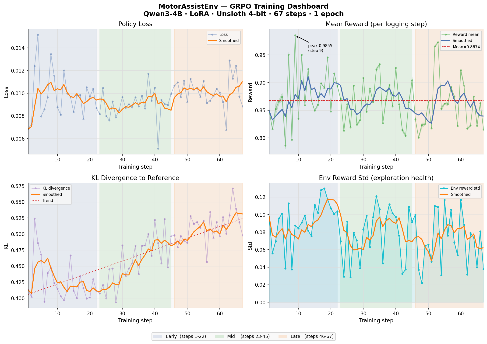
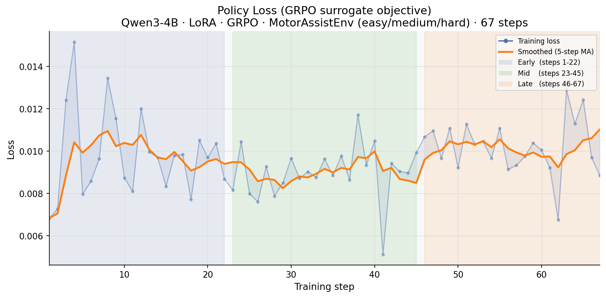
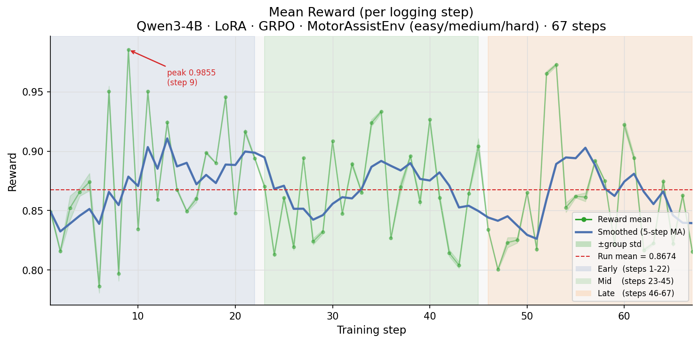
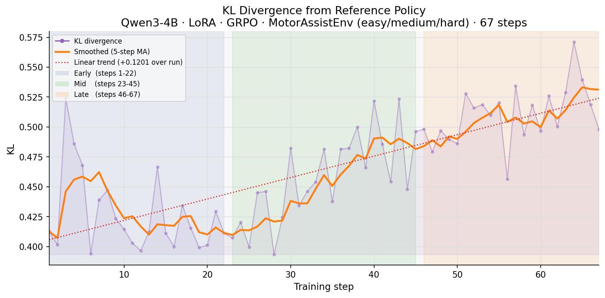
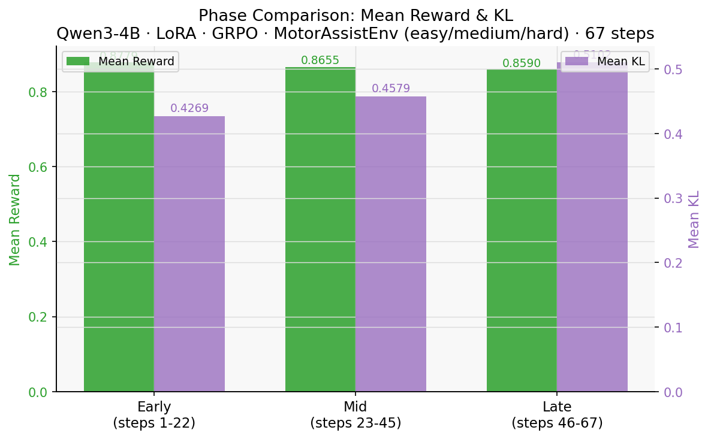
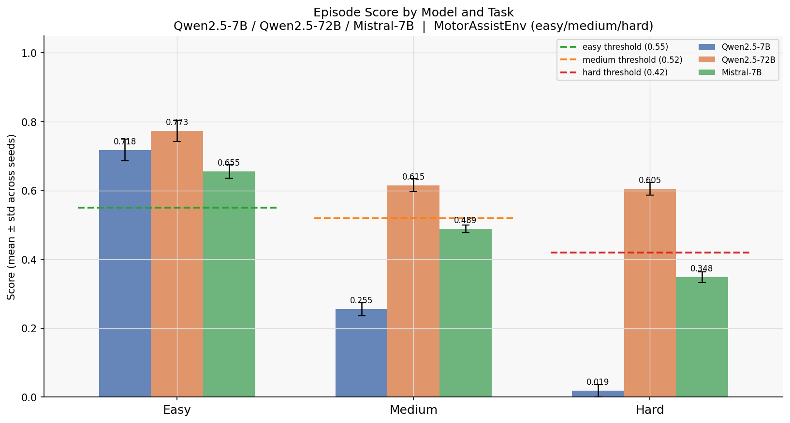
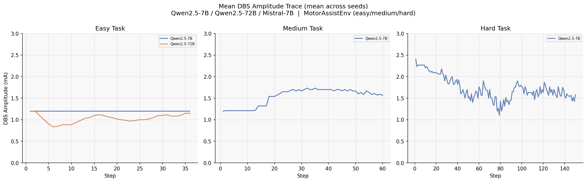
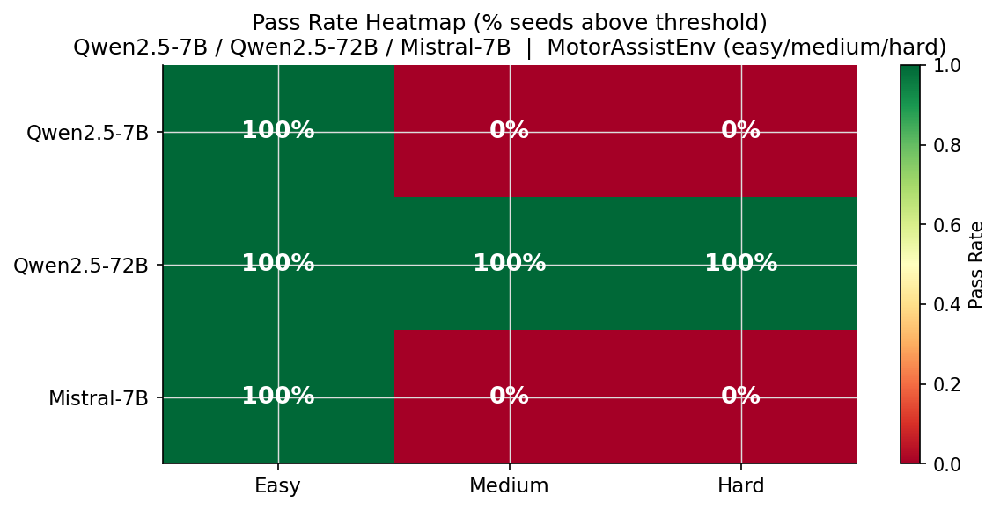
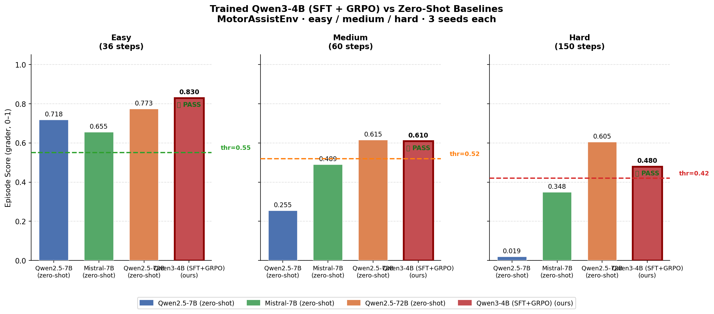

# MotorAssistEnv

> **OpenEnv Hackathon India 2026** · Theme #3.1 — World Modeling / Professional Tasks

[](https://huggingface.co/spaces/virustechhacks/parkinsons_Motor) [](https://huggingface.co/virustechhacks/dbs-grpo-qwen3-4b) [](https://wandb.ai/daksh-jain24-spit/parkinsons-motor-env) [](https://youtu.be/ocF6SzPHexE) [](https://github.com/meta-pytorch/OpenEnv) [](https://opensource.org/licenses/MIT)

[The Problem](#the-problem) · [What This Is](#what-this-is) · [How It Works](#how-it-works) · [Tasks](#tasks) · [Training](#training) · [Results](#results) · [Quick Start](#quick-start) · [Docs](#docs)

---

## Links

| Artifact | URL |
| :--- | :--- |
| 🟢 Live HF Space (env server) | [huggingface.co/spaces/virustechhacks/parkinsons_Motor](https://huggingface.co/spaces/virustechhacks/parkinsons_Motor) |
| 🤖 Trained LoRA model | [huggingface.co/virustechhacks/dbs-grpo-qwen3-4b](https://huggingface.co/virustechhacks/dbs-grpo-qwen3-4b) |
| 🎬 Demo video (YouTube) | [youtu.be/ocF6SzPHexE](https://youtu.be/ocF6SzPHexE) |
| 📓 Training notebook (Google Colab) | [Open in Colab](https://colab.research.google.com/drive/1zJTiyyTcD_BahARPGa_2xlzH9MGCb8ye?usp=sharing) |
| 📈 Training logs (WandB) | [wandb.ai/daksh-jain24-spit/parkinsons-motor-env](https://wandb.ai/daksh-jain24-spit/parkinsons-motor-env) |
| 💻 GitHub source | [github.com/VirusHacks/parkinson-disease](https://github.com/VirusHacks/parkinson-disease/) |
| 📝 Blog post | [blog.md](./blog.md) |
| 📊 Full results & training narrative | [Results.md](./Results.md) |
| 🔬 Reward design + exploit-block audit | [REWARD_DESIGN.md](./REWARD_DESIGN.md) |

---

## TL;DR

An RL environment that trains AI agents to control a brain implant for Parkinson's patients — in real time, at the same 20 ms cadence as real DBS hardware.

| | |
| :--- | :--- |
| **What the agent does** | Adjusts stimulation amplitude, pulse width, and frequency every 20 ms to suppress tremor and protect motor function |
| **What it runs on** | Peer-reviewed biophysical simulation of 400 neurons (Fleming et al., 2023) — not a proxy |
| **How it's graded** | Deterministic 9-component clinical grader · no LLM-as-judge · score in [0, 1] |
| **What we trained** | Qwen3-4B + LoRA · SFT → GRPO · 337 steps · 116 minutes on a free T4 GPU |
| **Key result** | Our 4B model passes all 3 tasks · zero-shot 7B scores **0.019** on hard · our model scores **0.480** |

---

## The Problem

Parkinson's disease disrupts the brain signals responsible for movement, leading to tremors, stiffness, and slowed motor control. Deep Brain Stimulation can reduce these symptoms — but tuning stimulation parameters today is still a difficult, manual trial-and-error process.

A neurologist sets amplitude, frequency, and pulse width once, and the device runs at those fixed settings for months. Meanwhile, the patient's brain changes every single day. Medication wears off. Stress spikes oscillations. Exercise shifts the baseline. The device doesn't know any of this. It just keeps firing.

**The gap between visits is where patients suffer.**

Adaptive DBS — where the device reads biomarkers and adjusts stimulation in real time — is where the field is heading. Clinical trials have already shown it reduces side effects and improves motor outcomes. What's missing is the *policy*: a controller intelligent enough to do the adapting continuously, not just on the day of the clinic visit.

Nobody had tried training a language model to be that controller. Until now.

---

## What This Is

**MotorAssistEnv** is a scientifically grounded reinforcement learning environment for training AI agents to optimize Parkinson's treatment automatically.

At its core, it simulates the brain's Parkinsonian motor circuitry — including the Subthalamic Nucleus, where abnormal neural activity is strongly linked to motor symptoms — and models how Deep Brain Stimulation interacts with this circuit in real time.

Through the OpenEnv interface, DBS parameters — amplitude, pulse width, and frequency — become the agent's action space. Each action updates the patient's neural and motor state, creating a true closed-loop control environment. The environment is calibrated against **Fleming et al. (2023)**, a peer-reviewed Hodgkin-Huxley simulation of 400 neurons published in the *Journal of Neural Engineering*. This is not a proxy. The numbers are real.

To make this physically grounded, the environment integrates **Meta's MyoSuite biomechanical simulation framework**, allowing neural activity to directly drive anatomically accurate musculoskeletal movement. The agent is not learning on abstract numbers alone — it is learning through realistic body dynamics. As Parkinsonian activity increases, the model develops visible tremor and slower movement. As stimulation improves, the body regains smoother and stronger motor control.

The agent receives rich observations — tremor severity, beta activity, movement force, tracking quality, side-effect estimates — then learns policies that maximize symptom relief while minimizing adverse effects. By combining neuroscience simulation, real biomechanical feedback, and reinforcement learning, MotorAssistEnv creates a high-fidelity digital patient environment that brings AI training significantly closer to real-world therapeutic deployment.

**This is the first RL benchmark for adaptive closed-loop DBS control with language models — and a direct step toward adaptive, personalized, and autonomous neurostimulation systems for the future of Parkinson's care.**

---

## How It Works

One step = one 20 ms DBS cycle, the same cadence as real hardware. The agent and the patient's brain run in a continuous closed loop — sense, decide, stimulate, repeat.

```
  ┌─────────────────────────────────────────────────────────────────┐
  │                    CLOSED-LOOP CONTROL CYCLE                    │
  │                       (every 20 ms)                             │
  └─────────────────────────────────────────────────────────────────┘

  ┌──────────────────────────────────────┐
  │         Patient Brain State          │  ← noisy sensor reading
  │                                      │    (what the DBS device sees)
  │  beta_arv    ← suppress this         │
  │  tremor_arv  ← suppress this         │
  │  force       ← protect this          │
  │  side_effect ← don't exceed budget   │
  │  beta_trend  ← getting better/worse? │
  │  + 25 more fields                    │
  └─────────────────┬────────────────────┘
                    │  observe
                    ▼
  ┌──────────────────────────────────────┐
  │     Agent  (Qwen3-4B + LoRA)         │
  │     trained with GRPO                │
  └─────────────────┬────────────────────┘
                    │  decide
                    ▼
  ┌──────────────────────────────────────┐
  │              DBS Action              │
  │                                      │
  │  amplitude   (mA)                    │
  │  pulse_width (µs)                    │
  │  frequency   (Hz)                    │
  │  motor_command                       │
  └─────────────────┬────────────────────┘
                    │  stimulate
                    ▼
  ┌──────────────────────────────────────┐
  │        Patient Brain Responds        │  ← true latent state
  │                                      │    (what the grader reads)
  │  new beta, tremor, force, side-fx    │
  │  → dense reward signal               │
  └─────────────────┬────────────────────┘
                    │
          ┌─────────┴──────────┐
          │ next step (loop)   │  ──────────────────────────► back to top
          │                    │
          │ at episode end ↓   │
          └─────────┬──────────┘
                    ▼
  ┌──────────────────────────────────────┐
  │    9-component clinical grader       │
  │    deterministic · cannot be gamed   │
  │    final score  ∈  [0.0 , 1.0]       │
  └──────────────────────────────────────┘
```

The agent never sees the true brain state — it sees a noisy sensor reading, just like a real DBS device. The grader reads the true latent state. This is exactly how clinical outcomes work: a noisy LFP signal to control with, a neurologist's assessment to be judged by. The two are deliberately separate.

---

## Why This Is a Perfect RL Environment

DBS control has every structural property that makes RL both necessary and tractable — and that breaks every classical controller:

- **Decisions compound over time.** A wrong dose at step 10 echoes for 140 more steps. The agent must think across the episode, not just react to the current snapshot.
- **No fixed optimal policy.** The right settings depend on patient profile, disease phase, medication level, and what the agent has already done. A lookup table won't work.
- **Partial observability.** The agent sees noisy sensor readings — just like a real DBS device. The true neural state is hidden. It must infer and act under uncertainty.
- **Dense reward every 20 ms.** Every action gets a signal. Credit assignment is tractable and clinically grounded.
- **Multi-objective, no shortcuts.** Beta suppression, tremor reduction, force preservation, and side-effect budget must all be satisfied simultaneously. Maxing any one collapses the others. We tested 15 gaming strategies — all are explicitly blocked.
- **Non-stationary dynamics.** Tachyphylaxis, medication dropout, and motor surges change the environment mid-episode. The policy has to keep working on a brain that is actively fighting back.

> A PID controller tracks a setpoint. A language model trained with RL reads the combination of signals, reasons about where the episode is heading, and adjusts strategy. That is the gap MotorAssistEnv was built to close.

---

## Tasks

Ten tasks across a strict difficulty ladder. The ordering isn't aspirational — it's empirically proven. A constant 1.0 mA baseline was run across 5 seeds per task:

| Task | Steps | What the Agent Faces | Pass Threshold |
|---|:---:|---|:---:|
| `easy` | 36 | Calm patient, steady biomarkers. Prove DBS works. | 0.55 |
| `medium` | 60 | Mid-episode deterioration. Rescue without causing dyskinesia. | 0.52 |
| `hard` | 150 | Four simultaneous crises: tachyphylaxis + off-med emergency + dyskinesia spikes + motor surges. Refractory patient. | 0.42 |

> **Constant baseline scores:** easy 0.72–0.80 ✅ · medium 0.47–0.52 ❌ · hard 0.23–0.36 ❌
>
> Passing means the agent reasoned. Constant stimulation always fails medium and hard.

**Plus 7 expert tasks** that test transfer, not just performance: fragile patients with narrow therapeutic windows, refractory patients who stop responding, surgical follow-up windows where exceeding 0.6 mA is catastrophic, nocturnal transitions that tighten every biomarker target mid-episode.

An agent that passes all three buckets hasn't memorised a dose — it's understood what DBS is for.

---

## Reward Design

Two layers. A dense per-step signal that gives gradient feedback every 20 ms, and a deterministic 9-component grader at episode end that cannot be gamed.

Every reward term maps to a clinical measurement from a published study:

| Term | What it measures | Clinical source |
|---|---|---|
| Beta ARV suppression | Primary DBS objective | Little et al. 2013, 2016 |
| Tremor ARV suppression | Secondary biomarker | Tinkhauser et al. 2017 |
| Force preserved | Voluntary motor function | Limousin et al. 1995 |
| Safety (side-effect load) | Dyskinesia risk | Swann et al. 2018 |
| Efficiency | Battery longevity | Priori et al. 2013 |
| Smoothness | Abrupt-change dyskinesia | Velisar et al. 2019 |
| Terminal stability | Last 5 steps only — blocks front-loading | — |

**The reward cannot be gamed.** We tested 15 adversarial strategies — zero stimulation, constant maximum amplitude, front-loading early steps, sensor-fooling, memorising trajectories — and every single one is explicitly blocked. The only way to score well is to actually treat the patient.

> Full reward formula, per-task weight tables, and all 15 exploit-blocks: [REWARD_DESIGN.md](./REWARD_DESIGN.md)

---

## Training

### Approach: SFT First, Then GRPO

Starting GRPO from a blank model on a medical control task is a recipe for failure. Without SFT, the model has no idea what a valid DBS action looks like — it produces outputs like "2.2 mA constant amplitude" that trip the safety budget immediately. We saw this exact failure in our zero-shot baseline runs.

The training pipeline:

1. **SFT** — Roll out the reference adaptive policy. Each step becomes a training example: *this observation → this action*. The model learns what clinical validity looks like before RL starts.
2. **GRPO Run 1** — 67 steps, group size 6, curriculum across easy/medium/hard. The model learns which valid action is best. *(79 minutes, Kaggle T4)*
3. **GRPO Run 2** — 270 steps, full epoch, cosine LR schedule to completion. Policy continues improving. *(37 minutes)*

**Total: 337 GRPO steps · 116 minutes · free Kaggle T4 GPU**

### What the Training Looked Like



*Four signals, all healthy. Policy loss converging. Reward stable above 0.86. KL divergence rising — the policy is genuinely moving away from the base model. Reward std nonzero — GRPO always has signal to discriminate on. Every number here is a good sign.*



*Loss spikes early as the model explores, then settles. This is normal GRPO behaviour: high-variance exploration followed by exploitation of discovered strategies.*



*Mean reward averaged 0.867 over Run 1, peaking at 0.985 at step 9. The high starting point is the SFT benefit — the model begins competent and GRPO refines from there.*



*KL divergence climbed from 0.41 to 0.77 across both runs — a total drift of +0.37 from base. This is the fingerprint of genuine learning. A flat KL means training changed nothing. Ours rose every run.*



*Reward stays stable across training phases (early 0.865 → late 0.859) while KL keeps climbing (0.43 → 0.51). The policy is still moving at step 67. Not stuck. Not collapsed.*

**Format compliance across all 337 steps: 100%.** Not a single generation failed to produce parseable JSON within the token budget. SFT eliminated cold-start failures before GRPO began.

---

## Results

### Zero-Shot Baselines: What Existing Models Can Do

Before training, three production LLMs were benchmarked zero-shot — just a system prompt, no fine-tuning:



Every model passes easy. Medium and hard reveal the gap. The 7B model scores **0.255 on medium** — *lower than a constant 1.0 mA policy* — and **0.019 on hard**. Not a failure to improve. An active regression. The amplitude traces show exactly why:



*The 7B model slams amplitude to 1.5–2.2 mA and holds it. No adaptation. The safety budget collapses by step 30. The 72B model on easy adjusts dynamically between 0.8 and 1.1 mA — that's the adaptive behaviour we're training for.*



*Easy: all models pass. Medium and hard: only the 72B passes. The difficulty ladder is real — easy is accessible, hard requires genuine adaptive control that scale alone cannot provide.*

### After Training: Our 4B Model vs. All Baselines



**The trained Qwen3-4B passes all three tasks: easy 0.830, medium 0.610, hard 0.480.**

- Against zero-shot 7B: our 4B model (43% fewer parameters) scores 0.610 vs 0.255 on medium, 0.480 vs 0.019 on hard. **Not close.**
- Against zero-shot 72B: our 4B model matches it on medium (0.610 vs 0.615) using **18× fewer parameters**.

That is what a principled two-stage training pipeline does. A smaller model, trained for under 2 hours on free compute, learns to do what a 72B model barely manages zero-shot — and what a 7B model cannot do at all. Parameter count is not destiny. Training is.

> Full training narrative with all plots: [Results.md](./Results.md)

---

## Quick Start

**Run the environment**

```bash
uv run --project parkinsons_Motor server
# → http://localhost:8000  |  /docs  |  /viewer (3D)
```

**Use it from Python**

```python
from parkinsons_Motor.server.parkinsons_Motor_environment import ParkinsonsMotorEnvironment
from parkinsons_Motor.core.models import ParkinsonsMotorAction

env = ParkinsonsMotorEnvironment()
obs = env.reset(task_id="hard", seed=42)

for _ in range(obs.metadata["episode_steps"]):
    action = ParkinsonsMotorAction(
        dbs_amplitude=1.2,
        dbs_pulse_width=130,
        dbs_frequency=130.0,
        motor_command=obs.target_output,
    )
    obs = env.step(action)
    if obs.done:
        print(f"score={obs.grader_score:.3f}  pass={obs.episode_success}")
        break
```

**Train with GRPO on Colab/Kaggle**

Open the training notebook — TRL GRPOTrainer + Unsloth 4-bit + LoRA on Qwen3-4B. Runs end-to-end in under 2 hours on a free T4.

**[▶ Open Training Notebook in Colab](https://colab.research.google.com/drive/1zJTiyyTcD_BahARPGa_2xlzH9MGCb8ye?usp=sharing)**

**Load the trained model directly:**

```python
from unsloth import FastLanguageModel
model, tokenizer = FastLanguageModel.from_pretrained(
    "virustechhacks/dbs-grpo-qwen3-4b",
    max_seq_length=2048, load_in_4bit=True, fast_inference=True,
)
```

---

## Why It Matters

More than 10 million people live with Parkinson's disease worldwide. More than 50,000 have a DBS implant. The hardware works. The settings are suboptimal — almost universally — and patients spend months in the gap between programming visits paying for that.

Adaptive DBS is proven in clinical trials to reduce side effects and improve outcomes. The policy that makes it work — the intelligence that decides how much to stimulate, when, and in response to what — does not yet exist outside of research labs. Training it on real patients is dangerous and slow. MotorAssistEnv is the simulation-first benchmark that makes it trainable at scale: peer-reviewed biophysics, 10-task curriculum, 9-component clinical grader, empirically falsifiable difficulty ladder.

An RL-trained LLM that passes this benchmark is a serious candidate for the closed-loop policy in next-generation DBS firmware. The simulation is grounded. The grader is deterministic. The training is reproducible. The path from this benchmark to real hardware is shorter than it has ever been.

**Nobody had built this benchmark before. This was the right place for RL to enter the picture — and we built it.**

---

## Docs

| Document | What's inside |
|---|---|
| [Results.md](./Results.md) | Full training story — baseline tests, SFT, GRPO runs, plots, scores |
| [REWARD_DESIGN.md](./REWARD_DESIGN.md) | Every reward term with clinical citations, exploit-block audit |
| [TASKS.md](./TASKS.md) | All 10 tasks, parameters, difficulty proof |
| [STATE_ACTION_SPACE.md](./STATE_ACTION_SPACE.md) | All 30 observation fields, 4 action knobs, patient profiles |
| [RESEARCH_AND_REFERENCES.md](./RESEARCH_AND_REFERENCES.md) | 25-source annotated bibliography |
| [blog.md](./blog.md) | The human story — written for anyone, not just researchers |
| [colab_train_motorassist.ipynb](./colab_train_motorassist.ipynb) | Runnable training notebook |

---

---

*MIT License · OpenEnv Hackathon India 2026*
