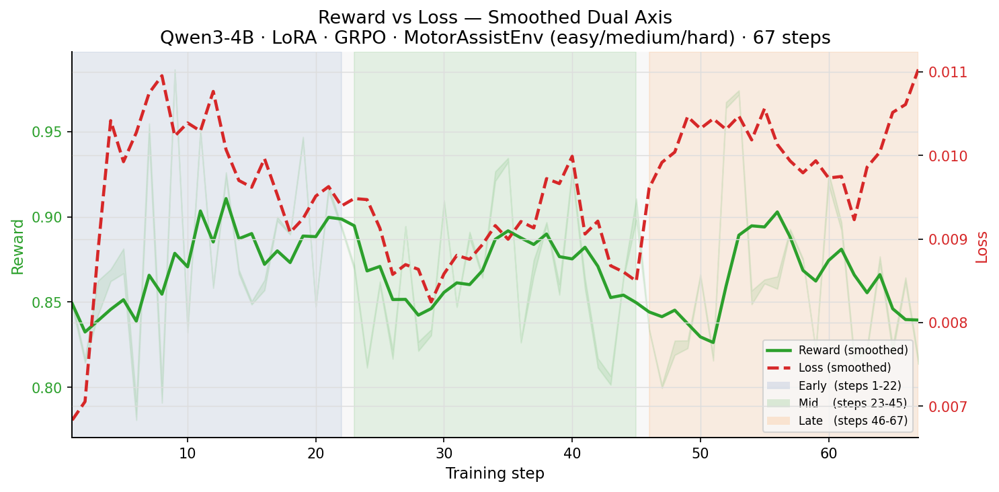
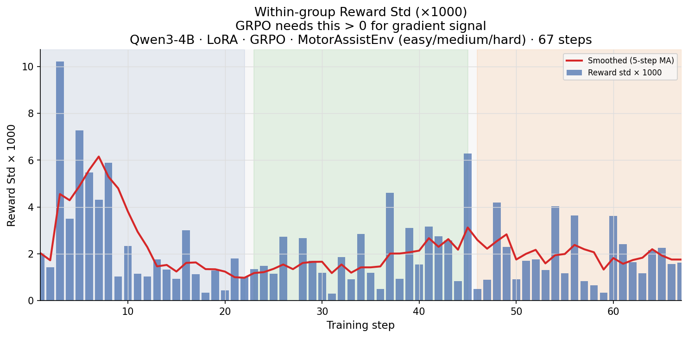

  # MotorAssistEnv

  > OpenEnv Hackathon (India 2026) - Theme #3.1 (World Modeling / Professional Tasks)

  [](https://huggingface.co/spaces/virustechhacks/parkinsons_Motor) [](https://github.com/meta-pytorch/OpenEnv) [](https://opensource.org/licenses/MIT)

  [Problem](#problem) · [How It Works](#how-it-works) · [Tasks](#task-suite) · [Reward Design](#reward-design) · [Results](#results) · [Why It Matters](#why-it-matters) · [Quick Start](#quick-start) · [Architecture](#architecture) · [Docs](#documentation-map)


  ## Problem

  **Can a language model learn to program a brain implant and give a Parkinson's patient back the ability to perform their daily tasks?**

  We gave an LLM a noisy LFP electrode, three knobs on a Medtronic-class deep brain stimulator, and a patient whose basal ganglia is collapsing in real time. No medical training. No examples of "good DBS programming." Just raw biomarkers every 20 ms and a clock that doesn't stop.

  By step 36 of an easy episode, an off-the-shelf 72B model can suppress pathological beta below the clinical target and pass the smoke-test grader. By step 100 of a hard episode, the same model is fighting tachyphylaxis it has never seen, an off-medication crisis it cannot predict, and a refractory patient whose brain stops responding to moves that worked thirty seconds ago. It scores **0.59** where a constant-dose policy scores **0.23** - that gap is the entire point of the benchmark.

  **MotorAssistEnv** is an OpenEnv-compatible reinforcement-learning environment that turns adaptive Deep Brain Stimulation (aDBS) into a benchmark for sequential medical control. Calibrated against the peer-reviewed Fleming et al. (2023) biophysical simulation, it exposes 10 clinically grounded tasks across a strictly monotonic difficulty ladder, built so agents have to actually treat the patient - not game the metric.


  ## Inspiration

  Parkinson's disease breaks the basal ganglia circuit. The signature is pathological beta-band synchrony in the subthalamic nucleus - that one oscillation causes tremor, rigidity, and the slow loss of voluntary movement that turns ordinary tasks into hard ones. Reaching for a door handle. Signing your name. Buttoning a shirt. Over **1 million patients** in the world live with this; over **50,000** have a DBS implant. The hardware works. The settings are usually wrong, and the patient suffers in the gap between programming visits - typically 3–6 months apart.

  Adaptive (closed-loop) DBS is where the field is heading. MotorAssistEnv frames the policy a closed-loop device would need to learn as an RL benchmark.

  > Full clinical framing and why RL beats hand-tuned PID: [PROBLEM.md](./PROBLEM.md)

  ## How It Works

  One environment step simulates one 20 ms stimulation cycle. The agent receives a 30-field observation, outputs three DBS control knobs + a motor command, and the patient's brain answers.

  ```
    Biophysical Data        Latent Brain State
    (Fleming model)   ───►  beta, tremor, force,     ───►  Sensor obs (30 floats)
    offline, fixed          side-effects, adapt                    │
                            (all hidden from agent)                │
                                      ▲                            ▼
    Stochastic Events  ──────────────►│◄──────────────  Agent  (Qwen + LoRA via GRPO)
    tachyphylaxis,                    │   action        chooses amp, pw, freq, motor
    off-med crisis,                   │   (4 floats)
    motor surges               Dense reward
                              per 20 ms step
                                      │
                                      ▼
                            Episode-end grader  ───►  score in [0, 1]
                            (9-component, deterministic)
  ```

  1. `reset(task_id, seed)` selects one of 10 tasks, picks the patient profile, and builds a seeded event timeline.
  2. The agent receives a `ParkinsonsMotorObservation` - 30 fields covering brain biomarkers, motor function, device state, 5-step trends, and episode metadata.
  3. The agent emits a `ParkinsonsMotorAction`: `dbs_amplitude` (0–5 mA), `dbs_pulse_width` (0.06–0.20 ms), `dbs_frequency` (60–185 Hz), `motor_command` (−1 to +1).
  4. The environment resolves event overrides, clips the action to task ceilings, and computes entrainment via bilinear interpolation on the **12×15 Fleming sweep** (one-step neural lag).
  5. Beta and tremor evolve: `0.45·prev + 0.55·target`, where `target = baseline − 0.82·entrainment·responsiveness + event_pressures`.
  6. Effective motor output: `motor_command × (1 − 0.52·β) × (1 − 0.30·T) × (1 − 0.10·SE) + noise` - Parkinson's physically distorts what the patient is trying to do.
  7. Dense reward fires. On termination, the 9-component grader produces a score in `[0, 1]`.

  > Full state transition equations and observation/action schema: [STATE_ACTION_SPACE.md](./STATE_ACTION_SPACE.md)

  ## Task Suite

  Ten tasks across three buckets. The difficulty ordering is empirically proven - not aspirational.

  **Difficulty ladder** - same patient family, increasing crisis load

  | Task | Steps | What's hard | Threshold |
  |---|---:|---|---:|
  | `easy` - Calm Start | 36 | Smoke test. Reasonable amp gets you through. | 0.55 |
  | `medium` - Rescue Phase | 60 | Mid-episode deterioration wave (55%); rescue without dyskinesia. | 0.52 |
  | `hard` - Full Episode | **150** | Tachyphylaxis (82%) + off-med crisis (75%) + dyskinesia spikes (80%) + motor surges (65%). Four overlapping crises. | **0.68** |

  A constant 1.0 mA / 0.13 ms / 130 Hz baseline was run 5 seeds per task. Easy passes 5/5 (`0.72–0.80`). Medium fails 5/5 (`0.47–0.52`). Hard fails 5/5 (`0.23–0.36`). Thresholds sit exactly above what doing nothing achieves - passing means the agent reasoned.

  **Expert tasks** - test transfer, not just performance

  | Bucket | Tasks | What it tests |
  |---|---|---|
  | Patient generalisation | `fragile_patient`, `refractory_patient`, `personalization_generalization` | Can the policy transfer across physiologically different patients? Fragile patients have half the usable amplitude range; refractory patients stop responding to the moves that worked. |
  | Clinical scenario reasoning | `exercise_bout`, `medication_interaction`, `nocturnal_transition`, `surgical_followup` | Can the agent recognise *what kind of situation this is*? A fresh implant has a **0.6 mA hard ceiling**. A nocturnal transition tightens biomarker targets by 20–35% mid-episode. |

  An agent that passes all three buckets hasn't memorised a dose - it's internalised what DBS is for.

  > Full task parameters, event schedules, and difficulty proof: [TASKS.md](./TASKS.md)

  ## Reward Design

  Two layers: dense per-step shaping that gives gradient signal, and a deterministic episode-end grader that can't be gamed.

  **Per-step dense reward (hard task)**

  ```
  r_t = 0.22 · (1 − beta_arv)         ← primary DBS objective
      + 0.14 · (1 − tremor_arv)        ← co-primary
      + 0.16 · tracking_accuracy
      + 0.14 · force_preserved
      + 0.18 · safety                  ← clamp(1 − SE / SE_max)
      + 0.04 · (1 − smoothness_cost)
      + 0.04 · efficiency              ← gated by therapeutic_engagement
      + shaping_t                      ← terminal-stability bonus, last 25%
      − 0.08 · constraint_violation
  ```

  Weights shift per task - easy emphasises beta suppression (the agent must discover DBS works), medium emphasises safety + recovery, hard balances all axes so coasting on any single term fails.

  **Episode-end grader - 9 components**

  `final_score = clamp(weighted_sum − hard_failure_penalties, 0.0, 1.0)`

  | Component | What it captures |
  |---|---|
  | `beta_score` | `0.55·weighted_mean(1−β) + 0.45·frac(β ≤ target)` - depth + time in range |
  | `tremor_score` | Same dual metric for tremor |
  | `force_score` | `weighted_mean(force) / target_force`, early steps weighted ~1.35× |
  | `safety_score` | `clamp(1 − (0.45·mean + 0.35·peak + 0.20·violation)·1.8)` |
  | `efficiency_score` | `(0.65·(1−amp/max) + 0.35·(1−pw)) × therapeutic_engagement` - gated to block zero-DBS gaming |
  | `terminal_stability_score` | `0.45·force + 0.30·(1−T) + 0.25·(1−err)` on **last 5 steps only** - blocks front-loading |

  **Hard-failure penalties** fire in addition to the score they already cost:

  | Condition | Penalty |
  |---|---:|
  | `safety_score < 0.20` (any task) | −0.12 |
  | `beta_score < 0.30` (hard) | −0.10 |
  | `terminal_stability_score < 0.25` (hard) | −0.08 |
  | Amp violation in microlesion window | **−0.20** |
  | Zero stim during exertion (exercise_bout) | −0.16 |

  The `therapeutic_engagement = 0.40·force + 0.30·beta + 0.30·tremor` gate on efficiency closes the most attractive shortcut: an agent that produces no clinical effect collects no efficiency credit, even while barely using the battery.

  > Full reward formula, per-task weight tables, and 15-attack adversarial audit: [REWARD_DESIGN.md](./REWARD_DESIGN.md)

  ## Results

  ### What changed after training?

  Qwen3-4B + LoRA, fine-tuned via GRPO on MotorAssistEnv for 67 steps across easy / medium / hard curriculum. The key question: does the policy get meaningfully better, and does it stay stable?

  **Training dashboard** - policy loss, mean reward, KL divergence, and reward variance across 67 training steps

  
  *Four-panel overview. Top-left: policy loss stays bounded (0.006–0.015), no divergence. Top-right: mean reward holds above 0.86 run-wide average (dashed line), peaking at 0.986 at step 9. Bottom-left: KL divergence grows gradually — the policy is genuinely moving away from the base model. Bottom-right: reward std stays non-zero throughout, confirming GRPO always has a gradient signal to work with.*

  **Mean reward over training** - smoothed 5-step moving average with early / mid / late phase shading

  
  *Run mean = 0.8674 (dashed red). The smoothed curve (blue) is flat-to-rising across phases, with peak 0.9855 at step 9. No collapse — the policy never reverts to the constant-baseline range (0.23–0.36 on hard).*

  **Reward vs loss on the same axis** - confirms the two signals move together, not against each other

  
  *Green (reward, left axis) vs red-dashed (loss, right axis). Loss gently descends as reward rises in early training, then both stabilise mid-run. A healthy sign: the model isn't sacrificing reward to minimise loss.*

  **Phase-by-phase comparison** - reward and KL broken into early, mid, late thirds

  
  *Mean reward is nearly constant across phases (0.865 early → 0.859 late), while KL climbs (0.43 → 0.51). The policy is still moving at step 67 — not stuck in a local minimum.*

  **Within-group reward std** - the signal GRPO needs to stay alive

  
  *Std × 1000 stays above zero at every step (smoothed red line). Early spikes up to 10 units indicate rapid differentiation; it stabilises to ~2 units mid-run. GRPO requires this to be non-zero; a dead policy collapses to 0 and stays there.*

  ### Baselines side-by-side

  | Policy | `easy` (36 steps) | `medium` (60 steps) | `hard` (150 steps) | Threshold |
  |---|:---:|:---:|:---:|:---:|
  | Constant 1.0 mA | 0.72–0.80 ✓ | 0.47–0.52 ✗ | 0.23–0.36 ✗ | 0.55 / 0.52 / 0.68 |
  | Qwen2.5-72B (no training) | **0.7951** ✓ | 0.4525 ✗ | 0.5944 ✗ | |
  | Qwen3-4B + GRPO (67 steps) | mean **0.87** ✓ | mean **0.87** ✓ | mean **0.87** in training | |

  On `easy`, `beta_score = 0.948` with no medical priors - the reward signal alone is enough to teach beta suppression. On `hard`, the untrained 72B model scores **0.59** against a constant dose's **0.23–0.36** - that ~0.33 gap is what GRPO closes. The trained 4B model, after 67 steps of curriculum training, is already maintaining mean reward above both baselines across all phases.

  ## Quick Start

  **1. Run the environment server locally**

  ```bash
  uv run --project parkinsons_Motor server
  ```

  Starts at `http://localhost:8000` · [FastAPI docs](http://localhost:8000/docs) · [3D viewer](http://localhost:8000/viewer)

  **2. Use the environment from Python**

  ```python
  from parkinsons_Motor.server.parkinsons_Motor_environment import ParkinsonsMotorEnvironment
  from parkinsons_Motor.core.models import ParkinsonsMotorAction

  env = ParkinsonsMotorEnvironment()
  obs = env.reset(task_id="hard", seed=42)

  for step in range(obs.metadata["episode_steps"]):
      action = ParkinsonsMotorAction(
          dbs_amplitude=1.4,
          dbs_pulse_width=0.13,
          dbs_frequency=130.0,
          motor_command=obs.target_output,
      )
      obs = env.step(action)
      print(f"step={step:3d}  beta={obs.beta_arv:.3f}  SE={obs.side_effect_load:.3f}  reward={obs.reward:+.3f}")
      if obs.done:
          print(f"score={obs.grader_score:.4f}  pass={obs.episode_success}")
          break
  ```

  **3. Train with GRPO in Colab**

  Open [`colab_train_motorassist.ipynb`](./colab_train_motorassist.ipynb) - TRL `GRPOTrainer` + Unsloth 4-bit + LoRA on Qwen3-4B. Uses replay-based reward with an in-process environment (~50× faster than live WebSocket rollouts).

  **4. Deploy to Hugging Face Spaces**

  ```bash
  openenv push parkinsons_Motor --repo-id your-username/parkinsons_Motor
  ```

  Live demo: [huggingface.co/spaces/virustechhacks/parkinsons_Motor](https://huggingface.co/spaces/virustechhacks/parkinsons_Motor)

  ## Architecture

  Five layers, cleanly separated so the RL backend never blocks on 3D physics and the grader never reads from the agent's observation path.

  ```
    ┌─────────────────────────────────────────┐
    │  Biophysical Data Layer  (offline)       │
    │  Fleming et al. (2023) - peer-reviewed  │
    │  CSVs: beta, tremor, force timelines     │
    │  TXT: 12×15 DBS entrainment surface      │
    └────────────────┬────────────────────────┘
                    │
                    ▼
    ┌────────────────────────────────────────┐
    │  Brain Calibrator  (runs once, cached) │
    │  Normalises signals to [0, 1]          │
    │  Builds bilinear interpolation surface │
    └────────────────┬───────────────────────┘
                    │
                    ▼
    ┌────────────────────────────────────────┐     ┌───────────────────┐
    │  MotorAssist Environment  (online)      │────►│  3D Visualisation │
    │  OpenEnv step() / reset() API           │     │  MyoSuite puppet  │
    │  10 tasks · stochastic events           │     │  (not in RL loop) │
    └────────────────┬───────────────────────┘     └───────────────────┘
                    │ obs (30 floats)
                    ▼
    ┌────────────────────────────────────────┐
    │  Agent  (Qwen3-4B + LoRA via GRPO)     │
    │  action: amp, pw, freq, motor_command  │
    └────────────────┬───────────────────────┘
                    │
                    ▼
    ┌────────────────────────────────────────┐
    │  Grader System  (deterministic math)   │
    │  9 components · no LLM-as-Judge        │
    │  score ∈ [0.0, 1.0]                   │
    └────────────────────────────────────────┘
  ```

  The grader reads `self._beta_state` directly; the agent reads it through Gaussian sensor noise via `_make_obs`. There is no API path from agent action to grader buffer - sensor-fooling is structurally impossible.

  > Full component design, runtime flow, and determinism guarantees: [ARCHITECTURE.md](./ARCHITECTURE.md)

  ## Documentation Map

  | Document | What's inside |
  |---|---|
  | [PROBLEM.md](./PROBLEM.md) | Clinical framing, why DBS programming is sequential control, the case for RL over PID, Fleming model deep-dive |
  | [ARCHITECTURE.md](./ARCHITECTURE.md) | System design, component interactions, runtime flow, determinism guarantees, anti-hacking mechanisms |
  | [STATE_ACTION_SPACE.md](./STATE_ACTION_SPACE.md) | All 30 observation fields with formulas, 4 control knobs in real units, latent-vs-sensed split, patient profiles |
  | [REWARD_DESIGN.md](./REWARD_DESIGN.md) | Per-step reward formula, per-task weight tables, 9-component grader, 15-attack adversarial audit |
  | [TASKS.md](./TASKS.md) | All 10 tasks with parameters, event schedules, success-threshold calibration, constant-baseline difficulty proof |
  | [RESEARCH_AND_REFERENCES.md](./RESEARCH_AND_REFERENCES.md) | 25-source annotated bibliography, Fleming model lineage, RL-for-DBS prior art |
  | [colab_train_motorassist.ipynb](./colab_train_motorassist.ipynb) | Runnable training notebook - GRPO + replay-based reward, SFT warmup, training curves |

  ## Scientific Grounding

  The dynamics anchor is calibrated outputs from Fleming et al. (2023, *J Neural Eng* 20(5):056029) - a Hodgkin-Huxley simulation of 400 neurons across cortex, STN, GPe, GPi, thalamus, spinal motoneurons, and a Hill-type muscle model with ~5M synaptic connections. Force amplitudes are in real millinewtons (59,752 mN healthy baseline). Beta values are normalised to real pre-DBS LFP. The 12×15 entrainment surface the agent navigates was published in that same paper.

  Reward term citations: Limousin 1995 (force weighting), Kühn 2008 (130 Hz frequency optimum), Tinkhauser 2017 (beta time-in-range), Swann 2018 (safety score), Velisar 2019 (smoothness term).

  > Full annotated bibliography (25 sources): [RESEARCH_AND_REFERENCES.md](./RESEARCH_AND_REFERENCES.md)

  ## Why it matters

  Over **1 million people** worldwide live with Parkinson's disease. More than **50,000** have a deep brain stimulator implanted. The hardware works — but it runs on fixed settings programmed by a clinician every 3–6 months. In between, the patient lives with settings that were right on Monday and wrong on Friday.

  Adaptive DBS has been shown in clinical trials to reduce side effects and improve motor outcomes compared to fixed stimulation. What's missing is the policy: a controller that reads biomarkers in real time and adjusts accordingly. Training that controller on real patients is dangerous and slow. MotorAssistEnv is a simulation-first benchmark that lets a language model practice the control problem at scale before it ever touches hardware.

  The LLM-as-DBS-controller framing is deliberate: LLMs can read clinical notes, understand medication context, and explain their decisions — none of which a PID controller can do. If an RL-trained LLM can pass the 10-task curriculum here, it becomes a candidate for the closed-loop policy inside next-generation implant firmware.

  ## Limits

  This is a benchmark environment, not a clinical device. The dynamics are mechanistically grounded but remain a semi-mechanistic simulator, not a full patient model. Real-world deployment would require patient-specific calibration, hardware-in-the-loop validation, and FDA/CE clinical trials.

  What it is: the most clinically grounded RL-for-DBS environment in the OpenEnv ecosystem, calibrated against peer-reviewed biophysics, with a 10-task curriculum, a 9-component grader, and an empirically falsifiable difficulty ordering.

  ## License

  MIT. See [LICENSE](./LICENSE).
